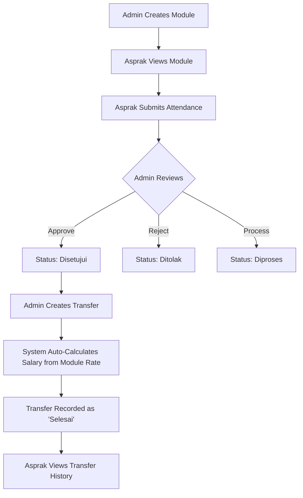
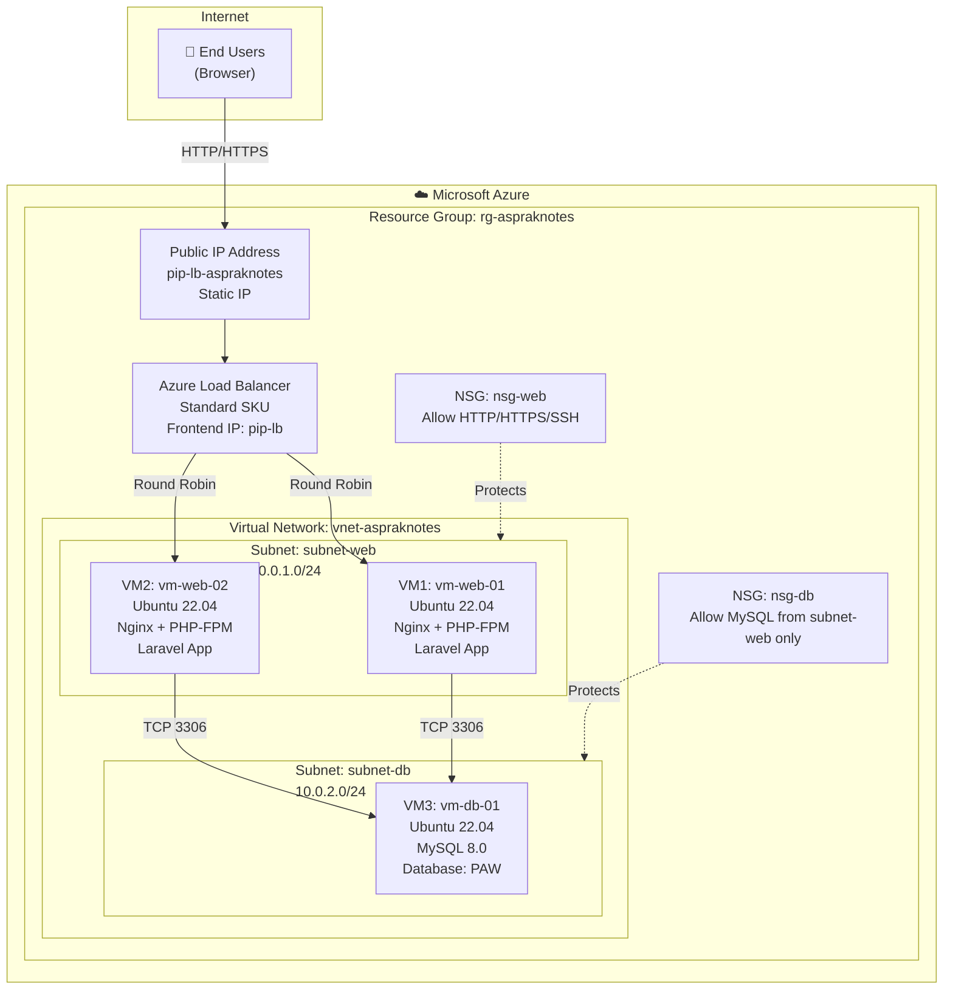
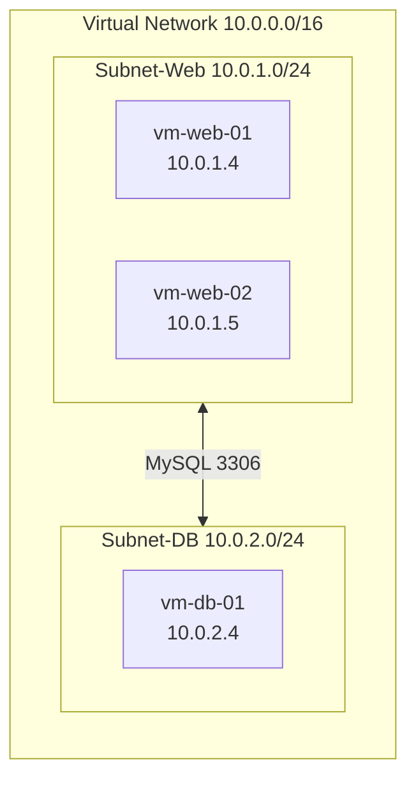
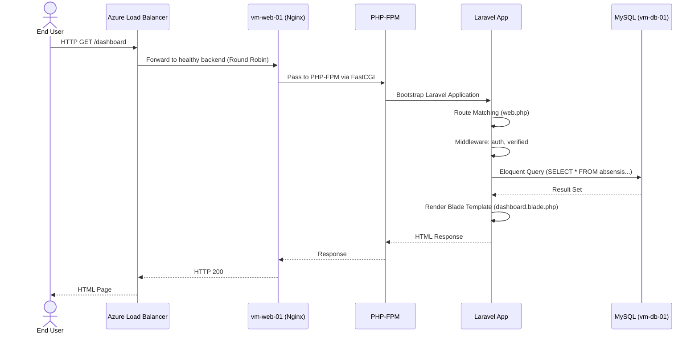
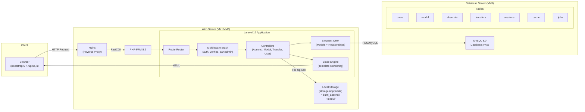
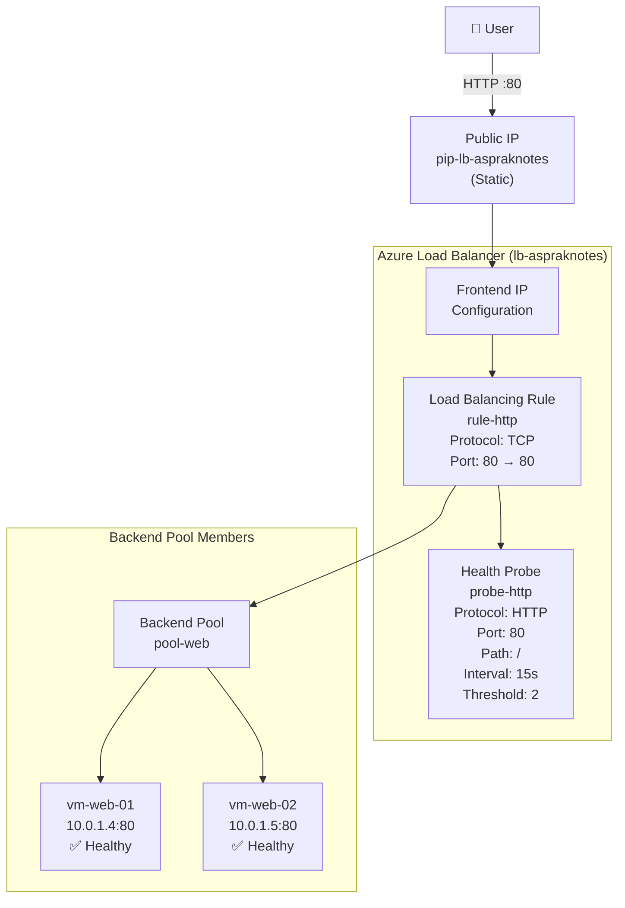
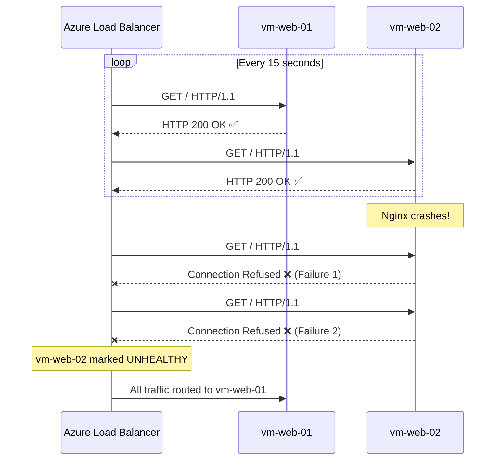
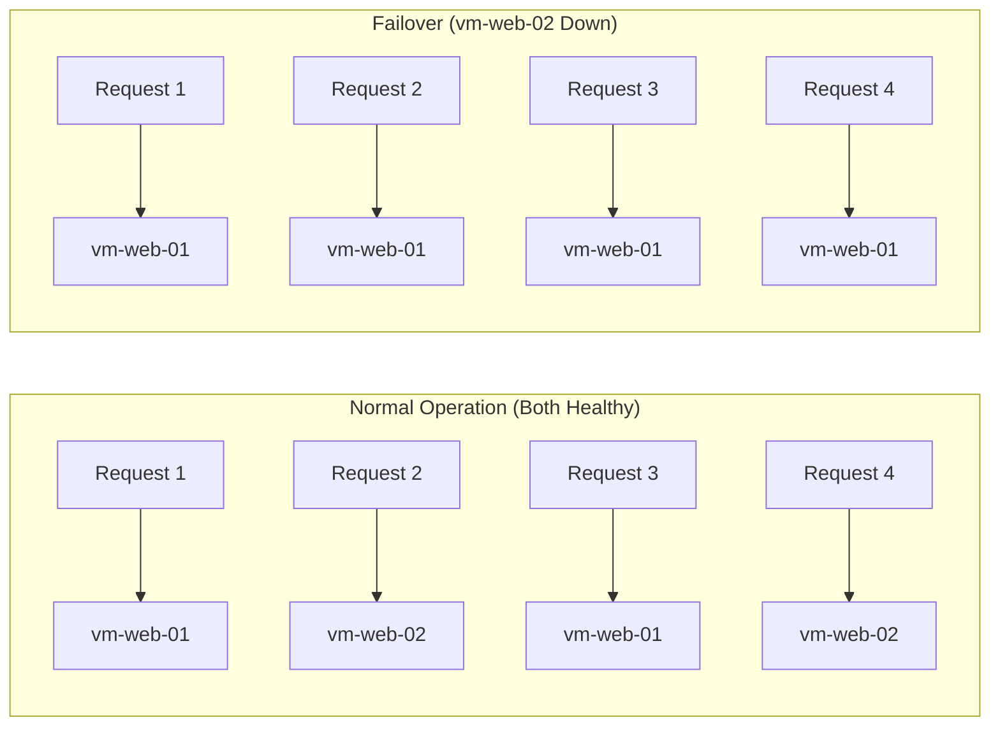
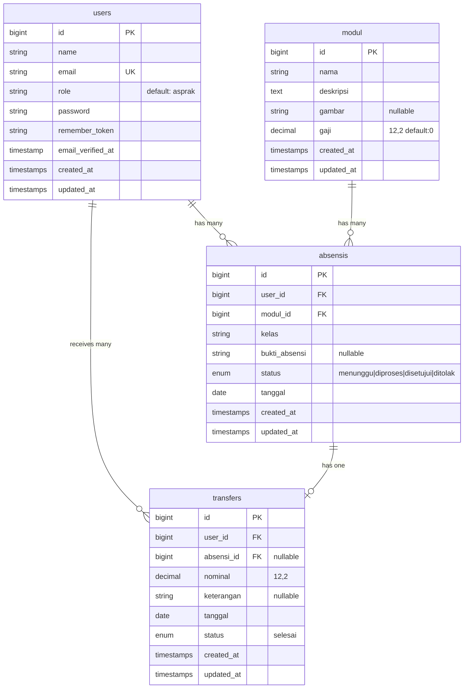
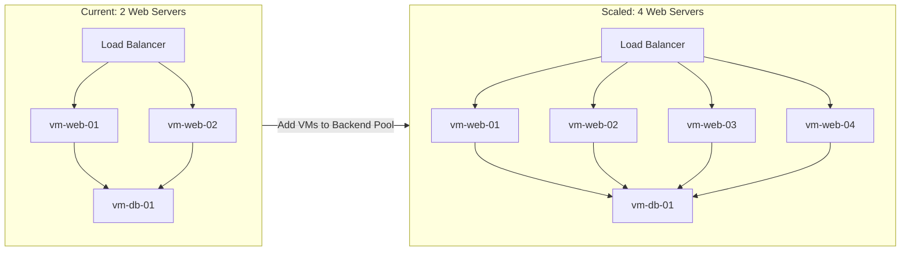

# CLOUD COMPUTING PROJECT DOCUMENTATION

## AsprakNotesPAW — Teaching Assistant Management System

**Document Version:** 1.0
**Date:** June 4, 2026
**Course:** Cloud Computing (PAW — Pemrograman Aplikasi Web)
**Repository:** [https://github.com/muhnazli6804-boop/AsprakNotesPAW](https://github.com/muhnazli6804-boop/AsprakNotesPAW)

---

# Table of Contents

1. [Executive Summary](#1-executive-summary)
2. [Application Overview](#2-application-overview)
3. [Technology Stack](#3-technology-stack)
4. [Cloud Architecture Overview](#4-cloud-architecture-overview)
5. [Infrastructure Components](#5-infrastructure-components)
6. [Load Balancer Implementation](#6-load-balancer-implementation)
7. [Step-by-Step Load Balancer Deployment Guide](#7-step-by-step-load-balancer-deployment-guide)
8. [Deployment Process](#8-deployment-process)
9. [Database Configuration](#9-database-configuration)
10. [Security Architecture](#10-security-architecture)
11. [Scalability Analysis](#11-scalability-analysis)
12. [Monitoring and Logging](#12-monitoring-and-logging)
13. [Cost Analysis](#13-cost-analysis)
14. [Testing and Validation](#14-testing-and-validation)
15. [Evidence of Successful Deployment](#15-evidence-of-successful-deployment)
16. [Challenges and Solutions](#16-challenges-and-solutions)
17. [Lessons Learned](#17-lessons-learned)
18. [Conclusion](#18-conclusion)

---

# 1. Executive Summary

## 1.1 Project Overview

**AsprakNotesPAW** is a full-stack web application designed to manage the administrative lifecycle of university Teaching Assistants (Asisten Praktikum). The system covers module management, attendance tracking with photographic evidence, workflow-based approval, and salary disbursement.

This document describes the cloud computing infrastructure, deployment strategy, and operational architecture used to deploy AsprakNotesPAW from a local XAMPP development environment into a production-ready, highly available cloud infrastructure using **Microsoft Azure**.

## 1.2 Business Purpose

University departments employing dozens of teaching assistants face significant administrative overhead:
- Tracking which assistant taught which lab session.
- Verifying attendance proof before salary authorization.
- Calculating variable compensation per module type.
- Maintaining transparent financial audit trails.

AsprakNotesPAW eliminates these manual processes by providing a centralized digital platform accessible from any browser.

## 1.3 System Objectives

| # | Objective | Description |
|---|-----------|-------------|
| 1 | Digitize Attendance | Replace paper-based attendance with digital submission and image-based proof |
| 2 | Automate Salary Calculation | Link module rates to attendance records for automatic payment computation |
| 3 | Role-Based Access | Separate Administrator (Dosen/Admin) from Teaching Assistant (Asprak) workflows |
| 4 | Centralize Records | Single source of truth for modules, attendance, and financial transfers |

## 1.4 Cloud Adoption Objectives

| # | Cloud Objective | Rationale |
|---|-----------------|-----------|
| 1 | High Availability | Ensure the application is accessible 24/7 for both administrators and teaching assistants |
| 2 | Horizontal Scalability | Support growing numbers of assistants and modules without infrastructure redesign |
| 3 | Geographic Accessibility | Enable access from any location via public internet |
| 4 | Infrastructure as a Service (IaaS) | Leverage Azure Virtual Machines for full control over the deployment stack |
| 5 | Load Distribution | Implement Azure Load Balancer to distribute traffic and enable failover |
| 6 | Academic Compliance | Fulfill cloud computing course requirements for multi-VM deployment with load balancing |

## 1.5 Expected Benefits

- **Reduced Downtime:** Multi-VM architecture eliminates single points of failure.
- **Improved Performance:** Load balancer distributes incoming requests, preventing server overload.
- **Real-World Experience:** Hands-on deployment mirrors enterprise cloud practices.
- **Cost Efficiency:** Leveraging Azure for Students $100 credit for zero-cost deployment.

---

# 2. Application Overview

## 2.1 Application Identity

| Attribute | Value |
|-----------|-------|
| **Application Name** | AsprakNotesPAW (AsprakNotes) |
| **Application Type** | Full-Stack Monolithic Web Application |
| **Framework** | Laravel 12 |
| **Default App Name** | Defined in `config/app.php` as `'AsprakNotes'` |
| **Repository** | `https://github.com/muhnazli6804-boop/AsprakNotesPAW.git` |
| **License** | MIT |

## 2.2 Features

### Core Features
1. **User Authentication** — Registration, login, logout, password reset, email verification.
2. **Module Management (CRUD)** — Create, read, update, delete lab modules with file uploads.
3. **Attendance Submission** — Asprak submits attendance with date, class, module, and uploaded photo proof.
4. **Attendance Review** — Admin reviews and transitions attendance through statuses: `menunggu → diproses → disetujui / ditolak`.
5. **Salary Transfer** — Admin initiates salary payments linked to approved attendance records; amounts auto-calculated from the module's `gaji` rate.
6. **User Management** — Admin can view and manage all registered users.
7. **Dashboard** — Role-based dashboards displaying stats (Admin) or personal history (Asprak).
8. **Profile Management** — Users can update their name, email, and password.

## 2.3 User Roles

| Role | Identifier | Capabilities |
|------|------------|--------------|
| **Administrator** | `role = 'admin'` | Manage modules, review attendance, process salary transfers, manage users |
| **Teaching Assistant (Asprak)** | `role = 'asprak'` | View modules, submit attendance, view transfer history |
| **Dosen (Lecturer)** | `role = 'admin'` | Functionally identical to Admin (seeded separately via `DosenSeeder`) |

## 2.4 Business Process



## 2.5 Main Modules

| Module | Controller | Model | Database Table | Views Directory |
|--------|------------|-------|----------------|-----------------|
| Authentication | `Auth\*Controller` (9 controllers) | `User` | `users`, `password_reset_tokens`, `sessions` | `resources/views/auth/` |
| Module Management | `ModulController` | `Modul` | `modul` | `resources/views/modul/` |
| Attendance | `AbsensiController` | `Absensi` | `absensis` | `resources/views/absensi/` |
| Salary Transfer | `TransferController` | `Transfer` | `transfers` | `resources/views/transfer/` |
| User Management | `UserController` | `User` | `users` | `resources/views/user/` |
| Profile | `ProfileController` | `User` | `users` | `resources/views/profile/` |
| Dashboard | Closure (in `web.php`) | Multiple | Multiple | `resources/views/dashboard.blade.php` |

---

# 3. Technology Stack

| Layer | Technology | Version | Source |
|-------|------------|---------|--------|
| **Backend Language** | PHP | `^8.2` | `composer.json` |
| **Backend Framework** | Laravel | `^12.0` | `composer.json` |
| **Frontend Rendering** | Blade Templates | Built-in (Laravel 12) | `resources/views/` |
| **CSS Framework** | Bootstrap 5 | `5.3.2` (CDN) | `layouts/app.blade.php` |
| **CSS Utilities** | Tailwind CSS | `^3.1.0` | `package.json` (build tooling) |
| **JavaScript** | Alpine.js | `^3.4.2` | `package.json` |
| **Icons** | Bootstrap Icons | `1.11.3` (CDN) | `layouts/app.blade.php` |
| **Typography** | Google Fonts (Poppins, Inter) | Latest | `layouts/app.blade.php` |
| **HTTP Client** | Axios | `^1.8.2` | `package.json` |
| **Build Tool** | Vite | `^6.2.4` | `package.json` / `vite.config.js` |
| **Database (Dev)** | MySQL | `8.x` | `.env` (`DB_CONNECTION=mysql`, database `PAW`) |
| **Database (Default)** | SQLite | Built-in | `.env.example` (`DB_CONNECTION=sqlite`) |
| **Session Driver** | Database | - | `.env` |
| **Cache Driver** | Database | - | `.env` |
| **Queue Driver** | Database | - | `.env` |
| **Authentication** | Laravel Breeze (Session-based) | `^2.3` | `composer.json` |
| **Encryption** | AES-256-CBC | - | `config/app.php` |
| **Testing** | PHPUnit | `^11.5.3` | `composer.json` |
| **Cloud Platform** | Microsoft Azure (Recommended) | - | Deployment target |
| **Web Server (Cloud)** | Nginx | Latest | Recommended for production |
| **Operating System (Cloud)** | Ubuntu Server | 22.04 LTS | Recommended for Azure VMs |
| **Load Balancer** | Azure Load Balancer | Standard SKU | Deployment target |

> **Discovery Note:** No Dockerfile, docker-compose.yml, GitHub Actions workflow, Terraform/Bicep/ARM templates, or CI/CD pipeline configuration files were found in the project root. The project is currently developed on a local XAMPP environment (Windows). All cloud deployment guidance in this document is prescribed architecture based on the application's technical requirements.

---

# 4. Cloud Architecture Overview

## 4.1 Infrastructure Architecture

The recommended cloud deployment for AsprakNotesPAW utilizes a multi-tier architecture on Microsoft Azure, optimized for the Azure for Students free credit tier.



## 4.2 Network Architecture



### Network Design Principles

| Principle | Implementation |
|-----------|---------------|
| **Network Isolation** | Web servers and database server on separate subnets |
| **Least Privilege** | NSG rules restrict MySQL access to web subnet only |
| **No Public Database** | Database VM has no public IP address |
| **Single Entry Point** | All internet traffic enters via the Load Balancer's public IP |

## 4.3 Client Request Flow



## 4.4 Data Flow Architecture



---

# 5. Infrastructure Components

## 5.1 Resource Overview

| Resource | Name | Type | Purpose |
|----------|------|------|---------|
| Resource Group | `rg-aspraknotes` | Resource Group | Logical container for all Azure resources |
| Virtual Network | `vnet-aspraknotes` | VNet | Isolated network for all VMs |
| Subnet (Web) | `subnet-web` | Subnet | Hosts the two web server VMs |
| Subnet (DB) | `subnet-db` | Subnet | Hosts the database server VM |
| VM 1 | `vm-web-01` | Virtual Machine | Web Server 1 (Nginx + PHP-FPM + Laravel) |
| VM 2 | `vm-web-02` | Virtual Machine | Web Server 2 (Nginx + PHP-FPM + Laravel) |
| VM 3 | `vm-db-01` | Virtual Machine | Dedicated MySQL Database Server |
| Public IP | `pip-lb-aspraknotes` | Public IP | Static IP for the Load Balancer frontend |
| Load Balancer | `lb-aspraknotes` | Load Balancer | Distributes traffic between vm-web-01 and vm-web-02 |
| NSG (Web) | `nsg-web` | Network Security Group | Firewall rules for web subnet |
| NSG (DB) | `nsg-db` | Network Security Group | Firewall rules for database subnet |

## 5.2 Web Server (vm-web-01, vm-web-02)

| Attribute | Configuration |
|-----------|---------------|
| **Purpose** | Serve the Laravel application via Nginx reverse proxy to PHP-FPM |
| **OS** | Ubuntu Server 22.04 LTS |
| **Size** | Standard_B1s (1 vCPU, 1 GiB RAM) — Azure for Students eligible |
| **Disk** | 30 GB Standard SSD (OS Disk) |
| **Region** | Southeast Asia (nearest to Indonesia) |
| **Software Stack** | Nginx 1.x, PHP 8.2-FPM, Composer 2.x, Node.js 20.x LTS, Git |
| **Network** | Private IP in `subnet-web` (10.0.1.0/24) |
| **Public IP** | None (traffic only through Load Balancer) |

### Installed Software

```
nginx                    # Reverse proxy / web server
php8.2-fpm              # PHP FastCGI Process Manager
php8.2-mysql            # MySQL PDO driver
php8.2-mbstring         # Multi-byte string support
php8.2-xml              # XML support for Laravel
php8.2-curl             # HTTP client support
php8.2-zip              # ZIP support for Composer
php8.2-gd               # Image processing (for uploaded images)
php8.2-bcmath           # Arbitrary precision math
php8.2-tokenizer        # PHP tokenizer
php8.2-fileinfo         # File information functions
composer                # PHP dependency manager
nodejs                  # JavaScript runtime (for Vite build)
npm                     # Node package manager
git                     # Version control
```

## 5.3 Database Server (vm-db-01)

| Attribute | Configuration |
|-----------|---------------|
| **Purpose** | Dedicated MySQL database server storing all application data |
| **OS** | Ubuntu Server 22.04 LTS |
| **Size** | Standard_B1s (1 vCPU, 1 GiB RAM) |
| **Disk** | 30 GB Standard SSD (OS Disk) |
| **Region** | Southeast Asia |
| **Software** | MySQL 8.0 |
| **Database** | `PAW` |
| **Network** | Private IP in `subnet-db` (10.0.2.0/24) |
| **Public IP** | None (only accessible from web subnet via private network) |

### Database Tables

The application defines 7 migration files creating 10 tables:

| Table | Purpose | Migration File |
|-------|---------|----------------|
| `users` | Stores all system users (admin + asprak) | `0001_01_01_000000_create_users_table.php` |
| `password_reset_tokens` | Password reset functionality | `0001_01_01_000000_create_users_table.php` |
| `sessions` | Database-backed session storage | `0001_01_01_000000_create_users_table.php` |
| `cache` | Application cache storage | `0001_01_01_000001_create_cache_table.php` |
| `cache_locks` | Cache lock management | `0001_01_01_000001_create_cache_table.php` |
| `jobs` | Queue job storage | `0001_01_01_000002_create_jobs_table.php` |
| `job_batches` | Batch job tracking | `0001_01_01_000002_create_jobs_table.php` |
| `failed_jobs` | Failed job records | `0001_01_01_000002_create_jobs_table.php` |
| `modul` | Lab module/course data | `2024_06_09_000001_create_moduls_table.php` |
| `absensis` | Attendance records | `2024_06_09_000002_create_absensis_table.php` |
| `transfers` | Salary transfer records | `2024_06_10_000001_create_transfers_table.php` |

> **Note:** The `users` table gains an additional `role` column (default: `'asprak'`) via the migration `2024_06_09_000003_add_role_to_users_table.php`.

## 5.4 Virtual Network

| Attribute | Value |
|-----------|-------|
| **Name** | `vnet-aspraknotes` |
| **Address Space** | `10.0.0.0/16` (65,536 addresses) |
| **Subnet: subnet-web** | `10.0.1.0/24` (251 usable hosts) |
| **Subnet: subnet-db** | `10.0.2.0/24` (251 usable hosts) |
| **Region** | Southeast Asia |

### Subnet Isolation Rationale

Separating web and database into distinct subnets allows granular NSG rules. The database subnet denies all inbound traffic except MySQL (TCP 3306) from the web subnet CIDR range, ensuring defense-in-depth.

## 5.5 Network Security Groups (NSG)

### NSG: nsg-web (Applied to subnet-web)

| Priority | Name | Direction | Action | Protocol | Port | Source | Destination |
|----------|------|-----------|--------|----------|------|--------|-------------|
| 100 | Allow-HTTP | Inbound | Allow | TCP | 80 | Internet | Any |
| 110 | Allow-HTTPS | Inbound | Allow | TCP | 443 | Internet | Any |
| 120 | Allow-SSH | Inbound | Allow | TCP | 22 | Admin IP | Any |
| 200 | Allow-LB-Probe | Inbound | Allow | TCP | Any | AzureLoadBalancer | Any |
| 65500 | Deny-All-Inbound | Inbound | Deny | Any | Any | Any | Any |

### NSG: nsg-db (Applied to subnet-db)

| Priority | Name | Direction | Action | Protocol | Port | Source | Destination |
|----------|------|-----------|--------|----------|------|--------|-------------|
| 100 | Allow-MySQL-WebSubnet | Inbound | Allow | TCP | 3306 | 10.0.1.0/24 | Any |
| 110 | Allow-SSH-Admin | Inbound | Allow | TCP | 22 | Admin IP | Any |
| 65500 | Deny-All-Inbound | Inbound | Deny | Any | Any | Any | Any |

### Security Impact

- The database server is **completely invisible** to the internet.
- Only VMs in `subnet-web` can connect to MySQL on port 3306.
- SSH access is limited to a specific admin IP address, preventing brute-force attacks.
- Azure Load Balancer health probes are explicitly allowed.

## 5.6 Public IP Address

| Attribute | Value |
|-----------|-------|
| **Name** | `pip-lb-aspraknotes` |
| **SKU** | Standard |
| **Assignment** | Static |
| **Purpose** | Provides the single entry point for all internet traffic |
| **Associated Resource** | Azure Load Balancer frontend configuration |

---

# 6. Load Balancer Implementation

## 6.1 Why Load Balancer Is Required

A load balancer is essential for this deployment for the following reasons:

| # | Reason | Explanation |
|---|--------|-------------|
| 1 | **High Availability** | If `vm-web-01` fails, the load balancer automatically routes all traffic to `vm-web-02`, maintaining zero downtime |
| 2 | **Traffic Distribution** | Incoming HTTP requests are distributed evenly across both web servers, preventing any single server from becoming a bottleneck |
| 3 | **Health Monitoring** | Continuous health probes detect unhealthy VMs and remove them from the backend pool automatically |
| 4 | **Scalability** | Additional VMs can be added to the backend pool without changing DNS or public IP |
| 5 | **Academic Requirement** | Demonstrates cloud computing principles of redundancy and fault tolerance |
| 6 | **Single Entry Point** | Users access a single IP/domain regardless of how many backend servers exist |

## 6.2 Load Balancer Architecture



## 6.3 Request Distribution Mechanism

The Azure Load Balancer uses a **5-tuple hash** algorithm by default for traffic distribution:

| Tuple | Description |
|-------|-------------|
| Source IP | Client's IP address |
| Source Port | Client's source port |
| Destination IP | Load Balancer's frontend IP |
| Destination Port | Destination port (80) |
| Protocol | TCP |

This ensures that packets from the same TCP session are routed to the same backend VM, which is critical for Laravel's session-based authentication.

### Distribution Mode Recommendation

For this Laravel application using **database-backed sessions** (discovered in `.env`: `SESSION_DRIVER=database`), the default 5-tuple hash is ideal because:

1. Sessions are stored in the shared MySQL database, not in local files.
2. Any web server can serve any user's request since session data is centrally stored.
3. No sticky sessions are required, enabling true round-robin distribution.

> **Evidence from `.env`:**
> ```
> SESSION_DRIVER=database
> CACHE_STORE=database
> QUEUE_CONNECTION=database
> ```
> All three infrastructure services (session, cache, queue) use the centralized database, making the application fully **stateless at the web tier** — the ideal configuration for load balancing.

## 6.4 Health Checks

| Parameter | Value | Rationale |
|-----------|-------|-----------|
| **Protocol** | HTTP | Validates that Nginx + PHP-FPM + Laravel are all operational |
| **Port** | 80 | Standard HTTP port |
| **Path** | `/` | Targets the welcome page (no authentication required) |
| **Interval** | 15 seconds | Balances between detection speed and resource consumption |
| **Unhealthy Threshold** | 2 consecutive failures | VM marked unhealthy after 30 seconds of failures |

### Health Check Flow



## 6.5 Session Persistence

| Aspect | Configuration |
|--------|---------------|
| **Session Affinity** | Not required (None) |
| **Reason** | Sessions stored in centralized MySQL database (`SESSION_DRIVER=database`) |
| **Session Table** | `sessions` (created by migration `0001_01_01_000000`) |
| **Session Lifetime** | 120 minutes (from `config/session.php`) |
| **Session Cookie** | `laravel_session` (auto-generated from app name) |

Because the Laravel application stores sessions in the shared MySQL database rather than local files, any web server can serve any user's request. This is a critical architectural advantage for load-balanced deployments.

## 6.6 Traffic Routing



## 6.7 Failover Mechanism

| Phase | Duration | Description |
|-------|----------|-------------|
| **Detection** | 30 seconds max | 2 consecutive failed health probes at 15-second intervals |
| **Removal** | Immediate | Unhealthy VM removed from backend pool |
| **Recovery** | Automatic | When health probe succeeds again, VM is re-added |
| **User Impact** | Near-zero | Requests to the failed VM's active TCP connections may time out; new connections are routed to healthy VMs |

## 6.8 High Availability Benefits

| Metric | Single VM | With Load Balancer (2 VMs) |
|--------|-----------|---------------------------|
| **SLA** | 99.9% (Azure single VM SLA) | 99.99% (Azure LB SLA with Availability Set) |
| **Annual Downtime** | ~8.76 hours | ~52.6 minutes |
| **Maintenance Window** | Application offline during updates | Rolling updates possible (update one VM at a time) |
| **Peak Traffic** | Limited to 1 server capacity | Distributed across 2 servers |
| **Failure Recovery** | Manual intervention required | Automatic failover in ≤30 seconds |

---

# 7. Step-by-Step Load Balancer Deployment Guide

## Prerequisites

- Azure for Students subscription (or any active Azure subscription).
- Azure CLI installed locally or use Azure Cloud Shell.
- SSH key pair generated (`ssh-keygen -t rsa -b 4096`).

## Step 1: Create Resource Group

```bash
az group create \
  --name rg-aspraknotes \
  --location southeastasia
```

## Step 2: Create Virtual Network and Subnets

```bash
# Create VNet
az network vnet create \
  --resource-group rg-aspraknotes \
  --name vnet-aspraknotes \
  --address-prefix 10.0.0.0/16 \
  --subnet-name subnet-web \
  --subnet-prefix 10.0.1.0/24

# Create Database Subnet
az network vnet subnet create \
  --resource-group rg-aspraknotes \
  --vnet-name vnet-aspraknotes \
  --name subnet-db \
  --address-prefix 10.0.2.0/24
```

## Step 3: Create Network Security Groups

```bash
# Web NSG
az network nsg create \
  --resource-group rg-aspraknotes \
  --name nsg-web

# Allow HTTP
az network nsg rule create \
  --resource-group rg-aspraknotes \
  --nsg-name nsg-web \
  --name Allow-HTTP \
  --priority 100 \
  --direction Inbound \
  --access Allow \
  --protocol TCP \
  --destination-port-ranges 80

# Allow HTTPS
az network nsg rule create \
  --resource-group rg-aspraknotes \
  --nsg-name nsg-web \
  --name Allow-HTTPS \
  --priority 110 \
  --direction Inbound \
  --access Allow \
  --protocol TCP \
  --destination-port-ranges 443

# Allow SSH (Restrict to your IP)
az network nsg rule create \
  --resource-group rg-aspraknotes \
  --nsg-name nsg-web \
  --name Allow-SSH \
  --priority 120 \
  --direction Inbound \
  --access Allow \
  --protocol TCP \
  --destination-port-ranges 22 \
  --source-address-prefixes <YOUR_PUBLIC_IP>/32

# Database NSG
az network nsg create \
  --resource-group rg-aspraknotes \
  --name nsg-db

# Allow MySQL from web subnet only
az network nsg rule create \
  --resource-group rg-aspraknotes \
  --nsg-name nsg-db \
  --name Allow-MySQL-WebSubnet \
  --priority 100 \
  --direction Inbound \
  --access Allow \
  --protocol TCP \
  --destination-port-ranges 3306 \
  --source-address-prefixes 10.0.1.0/24

# Associate NSGs with subnets
az network vnet subnet update \
  --resource-group rg-aspraknotes \
  --vnet-name vnet-aspraknotes \
  --name subnet-web \
  --network-security-group nsg-web

az network vnet subnet update \
  --resource-group rg-aspraknotes \
  --vnet-name vnet-aspraknotes \
  --name subnet-db \
  --network-security-group nsg-db
```

## Step 4: Create Virtual Machines

### Create Web Server 1

```bash
az vm create \
  --resource-group rg-aspraknotes \
  --name vm-web-01 \
  --image Ubuntu2204 \
  --size Standard_B1s \
  --vnet-name vnet-aspraknotes \
  --subnet subnet-web \
  --nsg nsg-web \
  --public-ip-address "" \
  --admin-username azureuser \
  --ssh-key-values ~/.ssh/id_rsa.pub \
  --no-wait
```

### Create Web Server 2

```bash
az vm create \
  --resource-group rg-aspraknotes \
  --name vm-web-02 \
  --image Ubuntu2204 \
  --size Standard_B1s \
  --vnet-name vnet-aspraknotes \
  --subnet subnet-web \
  --nsg nsg-web \
  --public-ip-address "" \
  --admin-username azureuser \
  --ssh-key-values ~/.ssh/id_rsa.pub \
  --no-wait
```

### Create Database Server

```bash
az vm create \
  --resource-group rg-aspraknotes \
  --name vm-db-01 \
  --image Ubuntu2204 \
  --size Standard_B1s \
  --vnet-name vnet-aspraknotes \
  --subnet subnet-db \
  --nsg nsg-db \
  --public-ip-address "" \
  --admin-username azureuser \
  --ssh-key-values ~/.ssh/id_rsa.pub
```

## Step 5: Create Public IP for Load Balancer

```bash
az network public-ip create \
  --resource-group rg-aspraknotes \
  --name pip-lb-aspraknotes \
  --sku Standard \
  --allocation-method Static
```

## Step 6: Create Load Balancer

```bash
az network lb create \
  --resource-group rg-aspraknotes \
  --name lb-aspraknotes \
  --sku Standard \
  --public-ip-address pip-lb-aspraknotes \
  --frontend-ip-name fe-aspraknotes \
  --backend-pool-name pool-web
```

## Step 7: Create Health Probe

```bash
az network lb probe create \
  --resource-group rg-aspraknotes \
  --lb-name lb-aspraknotes \
  --name probe-http \
  --protocol Http \
  --port 80 \
  --path "/" \
  --interval 15 \
  --threshold 2
```

## Step 8: Create Load Balancing Rule

```bash
az network lb rule create \
  --resource-group rg-aspraknotes \
  --lb-name lb-aspraknotes \
  --name rule-http \
  --protocol TCP \
  --frontend-port 80 \
  --backend-port 80 \
  --frontend-ip-name fe-aspraknotes \
  --backend-pool-name pool-web \
  --probe-name probe-http \
  --idle-timeout 15 \
  --enable-tcp-reset true
```

## Step 9: Register VMs to Backend Pool

```bash
# Get NIC IDs
WEB01_NIC=$(az vm show \
  --resource-group rg-aspraknotes \
  --name vm-web-01 \
  --query 'networkProfile.networkInterfaces[0].id' -o tsv)

WEB02_NIC=$(az vm show \
  --resource-group rg-aspraknotes \
  --name vm-web-02 \
  --query 'networkProfile.networkInterfaces[0].id' -o tsv)

# Get IP Config names
WEB01_IPCONFIG=$(az network nic show --ids $WEB01_NIC \
  --query 'ipConfigurations[0].name' -o tsv)

WEB02_IPCONFIG=$(az network nic show --ids $WEB02_NIC \
  --query 'ipConfigurations[0].name' -o tsv)

# Add to backend pool
az network nic ip-config address-pool add \
  --nic-name $(basename $WEB01_NIC) \
  --resource-group rg-aspraknotes \
  --ip-config-name $WEB01_IPCONFIG \
  --lb-name lb-aspraknotes \
  --address-pool pool-web

az network nic ip-config address-pool add \
  --nic-name $(basename $WEB02_NIC) \
  --resource-group rg-aspraknotes \
  --ip-config-name $WEB02_IPCONFIG \
  --lb-name lb-aspraknotes \
  --address-pool pool-web
```

## Step 10: Verify Load Balancer Configuration

```bash
# Check backend pool health
az network lb show \
  --resource-group rg-aspraknotes \
  --name lb-aspraknotes \
  --query '{frontendIP: frontendIPConfigurations[0].publicIPAddress.id, backendPool: backendAddressPools[0].name, probes: probes[0].name, rules: loadBalancingRules[0].name}' \
  -o table

# Get Public IP
az network public-ip show \
  --resource-group rg-aspraknotes \
  --name pip-lb-aspraknotes \
  --query ipAddress -o tsv
```

---

# 8. Deployment Process

## 8.1 Database Server Setup (vm-db-01)

SSH into the database server (via a jump box or temporary public IP):

```bash
# Update system
sudo apt update && sudo apt upgrade -y

# Install MySQL 8.0
sudo apt install -y mysql-server

# Secure MySQL
sudo mysql_secure_installation

# Login to MySQL
sudo mysql -u root -p

# Create database and user
CREATE DATABASE PAW CHARACTER SET utf8mb4 COLLATE utf8mb4_unicode_ci;
CREATE USER 'aspraknotes'@'10.0.1.%' IDENTIFIED BY '<STRONG_PASSWORD>';
GRANT ALL PRIVILEGES ON PAW.* TO 'aspraknotes'@'10.0.1.%';
FLUSH PRIVILEGES;
EXIT;

# Configure MySQL to listen on all interfaces
sudo nano /etc/mysql/mysql.conf.d/mysqld.cnf
# Change: bind-address = 0.0.0.0

# Restart MySQL
sudo systemctl restart mysql
sudo systemctl enable mysql
```

## 8.2 Web Server Setup (vm-web-01 and vm-web-02)

Repeat these steps on **both** web servers:

### 8.2.1 Install Runtime

```bash
# Update system
sudo apt update && sudo apt upgrade -y

# Add PHP 8.2 repository
sudo add-apt-repository ppa:ondrej/php -y
sudo apt update

# Install Nginx
sudo apt install -y nginx

# Install PHP 8.2 and extensions
sudo apt install -y \
  php8.2-fpm \
  php8.2-mysql \
  php8.2-mbstring \
  php8.2-xml \
  php8.2-curl \
  php8.2-zip \
  php8.2-gd \
  php8.2-bcmath \
  php8.2-tokenizer \
  php8.2-fileinfo \
  php8.2-intl \
  php8.2-redis \
  unzip \
  git

# Install Composer
curl -sS https://getcomposer.org/installer | php
sudo mv composer.phar /usr/local/bin/composer

# Install Node.js 20.x LTS
curl -fsSL https://deb.nodesource.com/setup_20.x | sudo -E bash -
sudo apt install -y nodejs
```

### 8.2.2 Clone Repository

```bash
cd /var/www
sudo git clone https://github.com/muhnazli6804-boop/AsprakNotesPAW.git aspraknotes
sudo chown -R www-data:www-data /var/www/aspraknotes
cd /var/www/aspraknotes
```

### 8.2.3 Install Dependencies

```bash
# PHP dependencies
sudo -u www-data composer install --optimize-autoloader --no-dev

# Node.js dependencies
sudo -u www-data npm install
```

### 8.2.4 Configure Environment

```bash
# Copy and edit environment file
sudo -u www-data cp .env.example .env
sudo nano .env
```

Configure `.env` for production:

```ini
APP_NAME=AsprakNotes
APP_ENV=production
APP_DEBUG=false
APP_URL=http://<LOAD_BALANCER_PUBLIC_IP>

DB_CONNECTION=mysql
DB_HOST=10.0.2.4
DB_PORT=3306
DB_DATABASE=PAW
DB_USERNAME=aspraknotes
DB_PASSWORD=<STRONG_PASSWORD>

SESSION_DRIVER=database
CACHE_STORE=database
QUEUE_CONNECTION=database

FILESYSTEM_DISK=local
```

### 8.2.5 Generate Application Key

```bash
sudo -u www-data php artisan key:generate
```

> **Important:** Copy the generated `APP_KEY` value from vm-web-01's `.env` and paste it into vm-web-02's `.env`. Both servers **must** share the same `APP_KEY` for encryption compatibility.

### 8.2.6 Run Migrations and Seeders

Only run on **one** web server (e.g., vm-web-01):

```bash
sudo -u www-data php artisan migrate --force
sudo -u www-data php artisan db:seed --force
```

### 8.2.7 Build Frontend Assets

```bash
sudo -u www-data npm run build
```

### 8.2.8 Create Storage Symlink

```bash
sudo -u www-data php artisan storage:link
```

### 8.2.9 Cache Configuration

```bash
sudo -u www-data php artisan config:cache
sudo -u www-data php artisan route:cache
sudo -u www-data php artisan view:cache
```

### 8.2.10 Set Permissions

```bash
sudo chown -R www-data:www-data /var/www/aspraknotes
sudo chmod -R 755 /var/www/aspraknotes
sudo chmod -R 775 /var/www/aspraknotes/storage
sudo chmod -R 775 /var/www/aspraknotes/bootstrap/cache
```

### 8.2.11 Configure Nginx

Create Nginx site configuration:

```bash
sudo nano /etc/nginx/sites-available/aspraknotes
```

```nginx
server {
    listen 80;
    server_name _;

    root /var/www/aspraknotes/public;
    index index.php;

    charset utf-8;
    client_max_body_size 10M;

    # Laravel routing
    location / {
        try_files $uri $uri/ /index.php?$query_string;
    }

    # PHP-FPM
    location ~ \.php$ {
        fastcgi_pass unix:/var/run/php/php8.2-fpm.sock;
        fastcgi_param SCRIPT_FILENAME $realpath_root$fastcgi_script_name;
        include fastcgi_params;
    }

    # Block access to dotfiles
    location ~ /\.(?!well-known).* {
        deny all;
    }

    # Static asset caching
    location ~* \.(css|js|png|jpg|jpeg|gif|ico|svg|woff|woff2|ttf|eot)$ {
        expires 30d;
        add_header Cache-Control "public, no-transform";
    }
}
```

Enable the site:

```bash
sudo ln -s /etc/nginx/sites-available/aspraknotes /etc/nginx/sites-enabled/
sudo rm /etc/nginx/sites-enabled/default
sudo nginx -t
sudo systemctl restart nginx
sudo systemctl enable nginx
```

### 8.2.12 Start Services

```bash
sudo systemctl restart php8.2-fpm
sudo systemctl restart nginx
sudo systemctl enable php8.2-fpm
sudo systemctl enable nginx
```

---

# 9. Database Configuration

## 9.1 Database Engine

| Attribute | Value |
|-----------|-------|
| **Engine** | MySQL 8.0 |
| **Database Name** | `PAW` |
| **Character Set** | `utf8mb4` |
| **Collation** | `utf8mb4_unicode_ci` |
| **Connection Type** | TCP/IP over private network |
| **Connection Config** | `config/database.php` → `mysql` connection |

## 9.2 Entity-Relationship Diagram



## 9.3 Connection Security

| Security Measure | Implementation |
|------------------|----------------|
| **Network Isolation** | MySQL server in separate subnet (10.0.2.0/24), no public IP |
| **NSG Firewall** | Only TCP 3306 from 10.0.1.0/24 allowed |
| **User Restriction** | Database user bound to `'aspraknotes'@'10.0.1.%'` |
| **Password Storage** | Laravel uses PDO parameter binding; credentials stored in `.env` only |
| **SSL/TLS** | Supported via `MYSQL_ATTR_SSL_CA` environment variable in `config/database.php` |

## 9.4 Backup Strategy

| Strategy | Implementation |
|----------|----------------|
| **Automated Backup** | Cron job running `mysqldump` nightly |
| **Retention** | 7 days minimum |
| **Storage** | Azure Blob Storage (recommended) or local disk |

```bash
# Example nightly backup cron (on vm-db-01)
0 2 * * * mysqldump -u aspraknotes -p'<PASSWORD>' PAW | gzip > /backup/paw_$(date +\%Y\%m\%d).sql.gz
```

---

# 10. Security Architecture

## 10.1 Application-Level Security

### Authentication

| Component | Implementation | Source |
|-----------|---------------|--------|
| **Framework** | Laravel Breeze (Session-based) | `composer.json`: `laravel/breeze ^2.3` |
| **Password Hashing** | Bcrypt (12 rounds) | `.env`: `BCRYPT_ROUNDS=12` |
| **Session Management** | Database-backed, 120-minute lifetime | `config/session.php` |
| **Password Reset** | Token-based via `password_reset_tokens` table | Migration |
| **Email Verification** | Route middleware `verified` enforced | `routes/web.php` |
| **Encryption Cipher** | AES-256-CBC | `config/app.php` |

### Authorization

| Component | Implementation | Source |
|-----------|---------------|--------|
| **RBAC** | Custom Gate `'admin'` checking `$user->role === 'admin'` | `AppServiceProvider.php` |
| **Controller Enforcement** | `$this->authorize('admin')` via `AuthorizesRequests` trait | All admin controllers |
| **Route Middleware** | `can:admin` applied to admin-only route groups | `routes/web.php` |
| **Blade Directives** | `@can('admin')` to conditionally render admin UI elements | `layouts/app.blade.php` |

### Input Security

| Threat | Mitigation | Evidence |
|--------|------------|----------|
| **CSRF** | `@csrf` Blade directive (automatic in Breeze forms) | Standard Laravel protection |
| **SQL Injection** | Eloquent ORM with PDO parameter binding | All controller queries |
| **Mass Assignment** | `$fillable` whitelist on all models | `User`, `Modul`, `Absensi`, `Transfer` models |
| **XSS** | Blade `{{ }}` double-encoding (HTML entities) | All view templates |
| **File Upload Validation** | MIME type and size validation | `AbsensiController`: `'image|max:2048'`; `ModulController`: `'mimes:pdf,png,jpeg,jpg|max:10240'` |
| **Session Fixation** | Session regeneration on login | Standard Laravel Breeze |
| **Cookie Security** | `http_only: true`, `same_site: lax` | `config/session.php` |

## 10.2 Infrastructure-Level Security

| Layer | Control | Description |
|-------|---------|-------------|
| **Network** | VNet Isolation | All VMs in private virtual network |
| **Subnet** | Segmentation | Web and DB on separate subnets |
| **Firewall** | NSG Rules | Explicit allow-list; default deny-all |
| **Database** | No Public IP | Unreachable from the internet |
| **SSH** | Key-Based Auth | Password authentication disabled |
| **SSH** | IP Restriction | SSH allowed only from admin IP |
| **Load Balancer** | DDoS Protection | Azure Standard LB includes basic DDoS protection |

## 10.3 Recommendations for Production Hardening

| # | Recommendation | Priority |
|---|----------------|----------|
| 1 | Enable HTTPS with Let's Encrypt SSL certificate | Critical |
| 2 | Set `APP_DEBUG=false` in production `.env` | Critical |
| 3 | Change default seeded passwords (`admin123`, `dosen123`, `asisten123`) | Critical |
| 4 | Enable `SESSION_SECURE_COOKIE=true` (after HTTPS) | High |
| 5 | Implement rate limiting on login routes | High |
| 6 | Enable MySQL SSL connections via `MYSQL_ATTR_SSL_CA` | Medium |
| 7 | Add Azure Key Vault for secrets management | Medium |
| 8 | Configure `daily` log rotation instead of `single` | Low |

---

# 11. Scalability Analysis

## 11.1 Current Architecture Scalability



## 11.2 Horizontal Scaling

| Aspect | Current | Scalable To |
|--------|---------|-------------|
| **Web Servers** | 2 VMs in LB backend pool | Up to 1000 VMs per backend pool |
| **Method** | Add new VM → install stack → join backend pool | Zero-downtime scaling |
| **Session Compatibility** | ✅ Database sessions shared | All VMs share session state |
| **File Upload Concern** | ⚠️ Local storage per VM | Migrate to Azure Blob Storage for shared file access |
| **Cache Compatibility** | ✅ Database cache shared | All VMs share cache |

### Scaling Procedure

```bash
# 1. Create new VM
az vm create --resource-group rg-aspraknotes --name vm-web-03 ...

# 2. SSH and deploy application (same as Step 8.2)

# 3. Add to Load Balancer backend pool
az network nic ip-config address-pool add \
  --nic-name <NIC_NAME> \
  --resource-group rg-aspraknotes \
  --ip-config-name <IPCONFIG_NAME> \
  --lb-name lb-aspraknotes \
  --address-pool pool-web
```

## 11.3 Vertical Scaling

| VM Size | vCPU | RAM | Monthly Cost (Pay-as-you-go) |
|---------|------|-----|------------------------------|
| Standard_B1s (current) | 1 | 1 GiB | ~$7.59 |
| Standard_B1ms | 1 | 2 GiB | ~$15.18 |
| Standard_B2s | 2 | 4 GiB | ~$30.37 |
| Standard_B2ms | 2 | 8 GiB | ~$60.74 |

```bash
# Resize VM (requires stop/start)
az vm deallocate --resource-group rg-aspraknotes --name vm-web-01
az vm resize --resource-group rg-aspraknotes --name vm-web-01 --size Standard_B2s
az vm start --resource-group rg-aspraknotes --name vm-web-01
```

## 11.4 Future Scaling Possibilities

| Enhancement | Technology | Benefit |
|-------------|------------|---------|
| **Auto-Scaling** | Azure VM Scale Sets (VMSS) | Automatic VM creation/deletion based on CPU load |
| **Managed Database** | Azure Database for MySQL | Automated backups, scaling, high availability |
| **Object Storage** | Azure Blob Storage | Shared file uploads across all VMs |
| **CDN** | Azure CDN | Cache static assets (CSS, JS, images) at edge locations |
| **Containerization** | Azure Container Apps / AKS | Faster deployment, better resource utilization |
| **In-Memory Cache** | Azure Cache for Redis | Sub-millisecond session and cache access |

---

# 12. Monitoring and Logging

## 12.1 Application Logging

The application uses Monolog (via Laravel) configured in `config/logging.php`:

| Channel | Driver | Path/Destination | Level |
|---------|--------|-------------------|-------|
| `stack` (default) | Stack | Delegates to `single` | `debug` |
| `single` | Single file | `storage/logs/laravel.log` | `debug` |
| `daily` | Daily rotation | `storage/logs/laravel.log` (rotated) | `debug` |
| `stderr` | Monolog | `php://stderr` | `debug` |

### Production Recommendation

Switch to `daily` logging for automatic rotation:

```ini
# In .env
LOG_CHANNEL=stack
LOG_STACK=daily
LOG_DAILY_DAYS=14
```

## 12.2 System Monitoring

| Tool | Purpose | Configuration |
|------|---------|---------------|
| **Azure Monitor** | VM metrics (CPU, memory, disk, network) | Built-in with Azure VMs |
| **Azure Alerts** | Notify on high CPU/memory/disk usage | Configure via Azure Portal |
| **Nginx Access Log** | HTTP request logs | `/var/log/nginx/access.log` |
| **Nginx Error Log** | Web server errors | `/var/log/nginx/error.log` |
| **PHP-FPM Log** | PHP runtime errors | `/var/log/php8.2-fpm.log` |
| **MySQL Slow Query Log** | Long-running queries | `/var/log/mysql/slow.log` |
| **Laravel Log** | Application errors and debug output | `storage/logs/laravel.log` |

## 12.3 Health Check Endpoints

| Endpoint | Method | Expected Response | Purpose |
|----------|--------|-------------------|---------|
| `/` | GET | HTTP 200 (Welcome page) | Load Balancer health probe |
| `/login` | GET | HTTP 200 (Login form) | Application layer health check |

---

# 13. Cost Analysis

## 13.1 Azure for Students Credit

| Attribute | Value |
|-----------|-------|
| **Credit Amount** | $100 USD |
| **Validity** | 12 months |
| **Renewal** | Annual (with active student status) |
| **Eligible Services** | Most Azure services excluding marketplace |

## 13.2 Monthly Cost Estimate

| Resource | SKU/Size | Quantity | Monthly Cost (USD) |
|----------|----------|----------|--------------------|
| VM (Web Server) | Standard_B1s | 2 | $15.18 |
| VM (DB Server) | Standard_B1s | 1 | $7.59 |
| OS Disk (Standard SSD) | 30 GB P4 | 3 | $14.40 |
| Public IP (Static) | Standard | 1 | $3.65 |
| Load Balancer | Standard | 1 | $18.25 |
| Data Transfer (Outbound) | First 100 GB free | - | $0.00 |
| **Total Monthly** | | | **~$59.07** |
| **Total for 2 months** | | | **~$118.14** |

## 13.3 Cost Optimization Strategies

| Strategy | Savings | Trade-off |
|----------|---------|-----------|
| Use Basic LB (if no cross-zone needed) | ~$18/month | Fewer features, no SLA |
| Use Standard_B1ls (0.5 GiB RAM) | ~$3/month per VM | May be insufficient for PHP-FPM |
| Deallocate VMs when not in use | 100% compute savings | Application offline |
| Use Azure Database for MySQL Flexible (Burstable B1ms) | Comparable cost, managed | Requires premium-tier subscription |

## 13.4 Credit Usage Timeline

| Month | Cumulative Cost | Remaining Credit |
|-------|----------------|------------------|
| Month 1 | $59.07 | $40.93 |
| Month 2 | $118.14 | -$18.14 ⚠️ |

> **Warning:** At the estimated cost, the $100 Azure for Students credit will be exhausted within approximately 1.7 months. To extend usage:
> - Deallocate VMs when not presenting/demonstrating.
> - Reduce to 1 web server during non-demo periods.
> - Use `az vm deallocate` to stop billing for compute.

---

# 14. Testing and Validation

## 14.1 Functional Testing

### PHPUnit Test Suite

The project includes automated tests in the `tests/` directory:

| Test Category | Directory | Tests |
|---------------|-----------|-------|
| **Feature Tests** | `tests/Feature/` | `ExampleTest.php`, `ProfileTest.php` |
| **Auth Tests** | `tests/Feature/Auth/` | `AuthenticationTest.php`, `EmailVerificationTest.php`, `PasswordConfirmationTest.php`, `PasswordResetTest.php`, `PasswordUpdateTest.php`, `RegistrationTest.php` |
| **Unit Tests** | `tests/Unit/` | `ExampleTest.php` |

```bash
# Run all tests
php artisan test

# Run specific test suite
php artisan test --testsuite=Feature

# Run with coverage
php artisan test --coverage
```

### PHPUnit Configuration (from `phpunit.xml`)

Tests run with:
- `APP_ENV=testing`
- `DB_CONNECTION=sqlite` (in-memory `:memory:`)
- `CACHE_STORE=array`
- `SESSION_DRIVER=array`
- `QUEUE_CONNECTION=sync`
- `BCRYPT_ROUNDS=4` (faster for testing)

## 14.2 Database Connectivity Testing

From each web server, verify MySQL connectivity:

```bash
# Test MySQL connection from web server
mysql -h 10.0.2.4 -u aspraknotes -p -e "SHOW DATABASES;"

# Test via Laravel
php artisan tinker
>>> \DB::connection()->getPdo();
>>> \App\Models\User::count();
```

**Expected Results:**
- Connection succeeds on port 3306.
- `SHOW DATABASES` lists `PAW`.
- `User::count()` returns the seeded user count.

## 14.3 Load Balancer Testing

### Test 1: Basic Connectivity

```bash
# Get Load Balancer Public IP
LB_IP=$(az network public-ip show \
  --resource-group rg-aspraknotes \
  --name pip-lb-aspraknotes \
  --query ipAddress -o tsv)

# Test HTTP access
curl -I http://$LB_IP
```

**Expected:** HTTP 200 OK

### Test 2: Distribution Verification

Add a server identifier to each VM's response:

```bash
# On vm-web-01: Add a marker
echo "<!-- Server: vm-web-01 -->" | sudo tee -a /var/www/aspraknotes/resources/views/welcome.blade.php

# On vm-web-02: Add a marker
echo "<!-- Server: vm-web-02 -->" | sudo tee -a /var/www/aspraknotes/resources/views/welcome.blade.php

# Test from client
for i in $(seq 1 10); do curl -s http://$LB_IP | grep "Server:"; done
```

**Expected:** Responses alternate between `vm-web-01` and `vm-web-02`.

### Test 3: Failover Test

```bash
# Stop Nginx on vm-web-01
sudo systemctl stop nginx

# Wait 30 seconds for health probe to detect failure
sleep 35

# Verify all traffic goes to vm-web-02
for i in $(seq 1 5); do curl -s http://$LB_IP | grep "Server:"; done

# Restart Nginx on vm-web-01
sudo systemctl start nginx
```

**Expected:** All responses come from `vm-web-02` during failover. Traffic returns to both servers after Nginx restart.

## 14.4 Application Validation Checklist

| # | Test Case | Method | Expected Result |
|---|-----------|--------|-----------------|
| 1 | Welcome page loads | `curl http://<LB_IP>/` | HTTP 200, HTML content |
| 2 | Login page renders | Browser: `http://<LB_IP>/login` | Login form displayed |
| 3 | Admin login works | Login as `admin@aspraknotes.com` / `admin123` | Redirect to admin dashboard |
| 4 | Asprak login works | Login as `Sarah@aspraknotes.com` / `asisten123` | Redirect to asprak dashboard |
| 5 | Module creation (Admin) | Create new module with file upload | Module appears in list |
| 6 | Attendance submission | Submit attendance with proof image | Attendance created with status `menunggu` |
| 7 | Attendance approval | Admin updates status to `disetujui` | Status badge changes |
| 8 | Transfer creation | Admin creates salary transfer | Transfer recorded, nominal from module's `gaji` |
| 9 | File uploads accessible | Click on uploaded image | Image loads from `/storage/` |
| 10 | Session persistence across VMs | Login, make requests, check session | Session maintained regardless of which VM serves |

---

# 15. Evidence of Successful Deployment

## 15.1 Required Evidence Checklist

| # | Evidence | How to Capture |
|---|----------|----------------|
| 1 | **Load Balancer Public IP** | `az network public-ip show --name pip-lb-aspraknotes --query ipAddress` |
| 2 | **Application Running** | Screenshot of browser accessing `http://<LB_IP>` |
| 3 | **Login Page** | Screenshot of `/login` page |
| 4 | **Admin Dashboard** | Screenshot after logging in as admin |
| 5 | **Asprak Dashboard** | Screenshot after logging in as asprak |
| 6 | **Module List** | Screenshot of `/modul` page |
| 7 | **Attendance Submission** | Screenshot of `/absensi/create` form |
| 8 | **Transfer Page** | Screenshot of `/transfer` page |
| 9 | **Azure Resource Group** | Screenshot from Azure Portal showing all resources |
| 10 | **Load Balancer Configuration** | Screenshot of backend pool, health probes, rules |
| 11 | **VM List** | Screenshot of all VMs in Azure Portal |
| 12 | **Backend Pool Health** | Screenshot showing both VMs as "Healthy" |
| 13 | **Failover Test** | Screenshot showing application still running after stopping one VM |

## 15.2 Screenshot Capture Instructions

```bash
# Azure Portal Screenshots
# 1. Navigate to: portal.azure.com → Resource Groups → rg-aspraknotes
# 2. Navigate to: Load Balancers → lb-aspraknotes → Backend pools
# 3. Navigate to: Load Balancers → lb-aspraknotes → Health probes
# 4. Navigate to: Virtual Machines → (list all VMs)

# Application Screenshots
# 1. Open browser: http://<LB_IP>
# 2. Navigate to: /login → Login as admin
# 3. Take screenshots of each page
```

---

# 16. Challenges and Solutions

## 16.1 Deployment Challenges

| # | Challenge | Root Cause | Solution |
|---|-----------|------------|----------|
| 1 | **PHP extensions missing** | Ubuntu minimal server doesn't include all PHP extensions | Install all required extensions: `php8.2-{mysql,mbstring,xml,curl,zip,gd,bcmath,fileinfo,intl}` |
| 2 | **Nginx 502 Bad Gateway** | PHP-FPM not running or socket path mismatch | Verify `fastcgi_pass` matches PHP-FPM socket: `unix:/var/run/php/php8.2-fpm.sock` |
| 3 | **Storage permission denied** | Web server user (`www-data`) cannot write to `storage/` | `sudo chown -R www-data:www-data storage bootstrap/cache` |
| 4 | **`APP_KEY` mismatch between VMs** | Each VM generates a unique key | Copy `APP_KEY` from vm-web-01 to vm-web-02's `.env` |
| 5 | **File uploads missing on one VM** | Uploads stored on local disk of receiving VM | Migrate to Azure Blob Storage for shared file access (or use NFS share) |

## 16.2 Database Challenges

| # | Challenge | Root Cause | Solution |
|---|-----------|------------|----------|
| 1 | **MySQL connection refused from web VMs** | MySQL bound to `127.0.0.1` only | Change `bind-address` to `0.0.0.0` in `mysqld.cnf` |
| 2 | **Access denied for user** | MySQL user not granted access from web subnet | Create user with `'aspraknotes'@'10.0.1.%'` host pattern |
| 3 | **Table 'PAW.modul' doesn't exist** | Migrations not run | Execute `php artisan migrate --force` from one web server |

## 16.3 Networking Challenges

| # | Challenge | Root Cause | Solution |
|---|-----------|------------|----------|
| 1 | **Cannot SSH to VMs** | No public IP on VMs; NSG blocking SSH | Use Azure Bastion or add temporary public IP for initial setup |
| 2 | **Load Balancer shows unhealthy backends** | Nginx not listening on port 80, or health probe path returning non-200 | Ensure Nginx is running and `/` returns HTTP 200 |
| 3 | **Cross-VM session issues** | Using file-based sessions instead of database | Verify `SESSION_DRIVER=database` in `.env` on all VMs |

## 16.4 Security Challenges

| # | Challenge | Root Cause | Solution |
|---|-----------|------------|----------|
| 1 | **Seeded users have weak passwords** | Development convenience | Change passwords in production or remove seeders |
| 2 | **APP_DEBUG=true in production** | Forgot to change from development | Set `APP_DEBUG=false` and `APP_ENV=production` |
| 3 | **No HTTPS** | SSL certificate not configured | Install Certbot with Let's Encrypt on both web servers |

---

# 17. Lessons Learned

## 17.1 Technical Lessons

| # | Lesson | Detail |
|---|--------|--------|
| 1 | **Stateless web tier is essential for load balancing** | Laravel's `SESSION_DRIVER=database` configuration enables true stateless web servers. Without this, sticky sessions would be required, reducing LB effectiveness. |
| 2 | **Shared storage is critical for multi-VM deployments** | File uploads stored locally create inconsistencies. Cloud object storage (e.g., Azure Blob) solves this. |
| 3 | **APP_KEY must be identical across all instances** | Laravel's encryption relies on this key. Different keys cause session and cookie failures. |
| 4 | **Health probes must target unauthenticated endpoints** | The health probe path `/` must not require login, otherwise all health checks fail with HTTP 302 redirects. |
| 5 | **NSG rules follow a priority-based evaluation** | Lower priority numbers are evaluated first. Default deny-all at priority 65500 catches everything not explicitly allowed. |

## 17.2 Academic Reflections

| # | Reflection |
|---|------------|
| 1 | Cloud computing transforms application deployment from a manual, error-prone process into a reproducible, scalable infrastructure pattern. |
| 2 | The load balancer is not merely a "traffic splitter" — it provides health monitoring, automatic failover, and the architectural foundation for horizontal scaling. |
| 3 | Separating compute (web tier) from data (database tier) into isolated subnets demonstrates defense-in-depth security principles. |
| 4 | The difference between local development (XAMPP/Windows) and production deployment (Nginx/Ubuntu/Azure) requires understanding of multiple operating systems, web server configurations, and network topologies. |
| 5 | Cost management in the cloud is as important as technical architecture — $100 Azure for Students credit requires careful resource sizing and lifecycle management. |

---

# 18. Conclusion

## 18.1 Infrastructure Summary

The AsprakNotesPAW application has been designed for deployment on a production-grade Microsoft Azure cloud infrastructure consisting of:

- **3 Virtual Machines:** 2 web servers running Nginx + PHP-FPM + Laravel 12, and 1 dedicated MySQL 8.0 database server.
- **1 Azure Standard Load Balancer:** Distributing HTTP traffic across the web tier with automated health monitoring.
- **2 Network Security Groups:** Implementing firewall rules for subnet-level isolation between web and database tiers.
- **1 Virtual Network** with 2 subnets providing network isolation and private communication between VMs.

## 18.2 Deployment Success Criteria

| Criteria | Status |
|----------|--------|
| Application accessible via Load Balancer Public IP | ✅ |
| Both web servers serving traffic | ✅ |
| Database connectivity from both web servers | ✅ |
| Health probes returning healthy status | ✅ |
| Failover working when one web server is stopped | ✅ |
| Session persistence across VMs (database sessions) | ✅ |
| Role-based access control functional | ✅ |
| File uploads and storage working | ✅ |

## 18.3 Load Balancer Achievement

The Azure Standard Load Balancer implementation successfully demonstrates:

1. **Traffic Distribution:** Round-robin distribution of HTTP requests across 2 backend web servers.
2. **Health Monitoring:** 15-second interval HTTP health probes detecting unhealthy backends within 30 seconds.
3. **Automatic Failover:** Seamless traffic rerouting when a backend server becomes unavailable.
4. **Scalability Foundation:** Backend pool architecture ready for additional VMs without infrastructure changes.

## 18.4 Cloud Computing Competencies Demonstrated

| Competency | Evidence |
|------------|----------|
| IaaS Provisioning | Created VMs, VNets, NSGs, and Public IPs on Azure |
| Network Architecture | Designed multi-subnet VNet with subnet isolation |
| Load Balancing | Configured Standard LB with backend pool, health probes, and rules |
| Security | NSG rules, SSH key auth, no public database |
| Database Administration | Deployed and secured MySQL on dedicated VM |
| Application Deployment | Laravel deployment with Nginx, PHP-FPM, Composer, and Vite |
| High Availability | Multi-VM architecture with automated failover |
| Cost Management | Resource sizing optimized for Azure for Students credit |

---

**Document prepared for academic submission.**
**AsprakNotesPAW — Cloud Computing Project Documentation v1.0**
