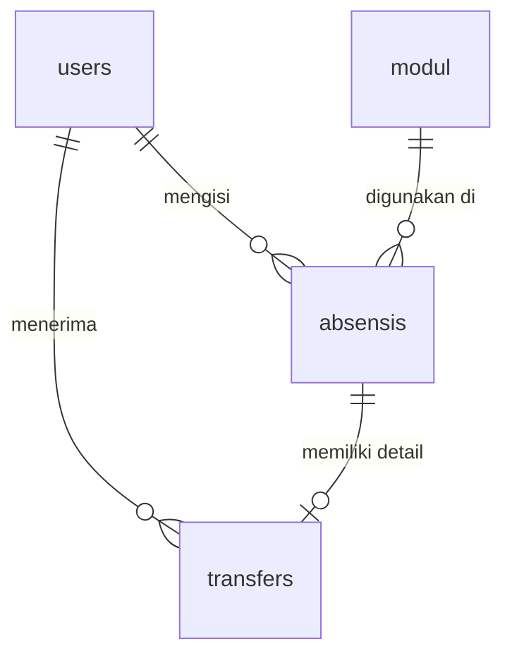

# Dokumentasi Query Database - AsprakNotesPAW

Dokumen ini berisi informasi lengkap mengenai skema database, relasi antar tabel, query SQL mentah (Raw SQL) yang digabungkan, serta padanan query menggunakan Laravel Eloquent ORM & Query Builder untuk proyek **AsprakNotesPAW** (Aplikasi Pencatatan & Penggajian Asisten Praktikum).

---

## 1. Entity Relationship Diagram (ERD) & Struktur Relasi



### Penjelasan Relasi:
1. **`users` -> `absensis` (One-to-Many)**: Satu user (`asprak`) dapat memiliki banyak catatan absensi. Menghubungkan `users.id` ke `absensis.user_id`.
2. **`modul` -> `absensis` (One-to-Many)**: Satu modul praktikum dapat diajarkan dalam banyak absensi. Menghubungkan `modul.id` ke `absensis.modul_id`.
3. **`users` -> `transfers` (One-to-Many)**: Satu user (`asprak`) dapat menerima banyak transfer honor/gaji. Menghubungkan `users.id` ke `transfers.user_id`.
4. **`absensis` -> `transfers` (One-to-One)**: Setiap pencatatan transfer gaji dikaitkan dengan satu absensi tertentu. Menghubungkan `absensis.id` ke `transfers.absensi_id` (nullable).

---

## 2. Struktur Tabel

Berikut adalah ringkasan kolom untuk setiap tabel dalam database:

### Tabel `users`
| Nama Kolom | Tipe Data | Atribut | Deskripsi |
| :--- | :--- | :--- | :--- |
| `id` | bigint | Primary Key, Auto Increment | ID unik user |
| `name` | varchar(255) | Not Null | Nama lengkap user |
| `email` | varchar(255) | Unique, Not Null | Email user |
| `role` | varchar(255) | Default: `'asprak'` | Role (`admin` atau `asprak`) |
| `password` | varchar(255) | Not Null | Password terenkripsi |

### Tabel `modul`
| Nama Kolom | Tipe Data | Atribut | Deskripsi |
| :--- | :--- | :--- | :--- |
| `id` | bigint | Primary Key, Auto Increment | ID unik modul |
| `nama` | varchar(255) | Not Null | Nama modul/praktikum |
| `deskripsi` | text | Not Null | Deskripsi modul |
| `gambar` | varchar(255) | Nullable | Path gambar modul |
| `gaji` | decimal(12,2) | Default: `0.00` | Gaji/honor per modul |

### Tabel `absensis`
| Nama Kolom | Tipe Data | Atribut | Deskripsi |
| :--- | :--- | :--- | :--- |
| `id` | bigint | Primary Key, Auto Increment | ID unik absensi |
| `user_id` | bigint | Foreign Key | Relasi ke `users.id` (Cascade) |
| `modul_id` | bigint | Foreign Key | Relasi ke `modul.id` (Cascade) |
| `kelas` | varchar(255) | Not Null | Kelas praktikum |
| `bukti_absensi` | varchar(255) | Nullable | Path gambar bukti absensi |
| `status` | enum | Default: `'menunggu'` | Status (`menunggu`, `diproses`, `disetujui`, `ditolak`) |
| `tanggal` | date | Not Null | Tanggal praktikum |

### Tabel `transfers`
| Nama Kolom | Tipe Data | Atribut | Deskripsi |
| :--- | :--- | :--- | :--- |
| `id` | bigint | Primary Key, Auto Increment | ID unik transfer |
| `user_id` | bigint | Foreign Key | Relasi ke `users.id` (Cascade) |
| `nominal` | decimal(12,2) | Not Null | Nominal transfer |
| `keterangan` | varchar(255) | Nullable | Keterangan transfer |
| `tanggal` | date | Not Null | Tanggal transfer |
| `status` | enum | Default: `'selesai'` | Status (`selesai`) |
| `absensi_id` | bigint | Foreign Key, Nullable | Relasi ke `absensis.id` (Set Null) |

---

## 3. Seluruh Script Raw SQL (DDL, Dummy Data, & DML/Query Aplikasi)

Berikut adalah seluruh query SQL mentah yang **digabungkan menjadi satu script**. Anda dapat menyalin seluruh kode di bawah ini untuk dijalankan langsung di database client (seperti phpMyAdmin/DBeaver):

```sql
-- =============================================================================
-- SECTION 1: DATA DEFINITION LANGUAGE (DDL) - PEMBUATAN TABEL & RELASI
-- =============================================================================

-- Hapus tabel jika sudah ada (urut berdasarkan dependensi untuk menghindari error foreign key)
DROP TABLE IF EXISTS `transfers`;
DROP TABLE IF EXISTS `absensis`;
DROP TABLE IF EXISTS `modul`;
DROP TABLE IF EXISTS `users`;

-- 1. Membuat Tabel users
CREATE TABLE `users` (
  `id` bigint unsigned NOT NULL AUTO_INCREMENT,
  `name` varchar(255) NOT NULL,
  `email` varchar(255) NOT NULL,
  `role` varchar(255) NOT NULL DEFAULT 'asprak',
  `email_verified_at` timestamp NULL DEFAULT NULL,
  `password` varchar(255) NOT NULL,
  `remember_token` varchar(100) DEFAULT NULL,
  `created_at` timestamp NULL DEFAULT NULL,
  `updated_at` timestamp NULL DEFAULT NULL,
  PRIMARY KEY (`id`),
  UNIQUE KEY `users_email_unique` (`email`)
) ENGINE=InnoDB DEFAULT CHARSET=utf8mb4 COLLATE=utf8mb4_unicode_ci;

-- 2. Membuat Tabel modul
CREATE TABLE `modul` (
  `id` bigint unsigned NOT NULL AUTO_INCREMENT,
  `nama` varchar(255) NOT NULL,
  `deskripsi` text NOT NULL,
  `gambar` varchar(255) DEFAULT NULL,
  `gaji` decimal(12,2) NOT NULL DEFAULT '0.00',
  `created_at` timestamp NULL DEFAULT NULL,
  `updated_at` timestamp NULL DEFAULT NULL,
  PRIMARY KEY (`id`)
) ENGINE=InnoDB DEFAULT CHARSET=utf8mb4 COLLATE=utf8mb4_unicode_ci;

-- 3. Membuat Tabel absensis
CREATE TABLE `absensis` (
  `id` bigint unsigned NOT NULL AUTO_INCREMENT,
  `user_id` bigint unsigned NOT NULL,
  `modul_id` bigint unsigned NOT NULL,
  `kelas` varchar(255) NOT NULL,
  `bukti_absensi` varchar(255) DEFAULT NULL,
  `status` enum('menunggu','diproses','disetujui','ditolak') NOT NULL DEFAULT 'menunggu',
  `tanggal` date NOT NULL,
  `created_at` timestamp NULL DEFAULT NULL,
  `updated_at` timestamp NULL DEFAULT NULL,
  PRIMARY KEY (`id`),
  KEY `absensis_user_id_foreign` (`user_id`),
  KEY `absensis_modul_id_foreign` (`modul_id`),
  CONSTRAINT `absensis_modul_id_foreign` FOREIGN KEY (`modul_id`) REFERENCES `modul` (`id`) ON DELETE CASCADE,
  CONSTRAINT `absensis_user_id_foreign` FOREIGN KEY (`user_id`) REFERENCES `users` (`id`) ON DELETE CASCADE
) ENGINE=InnoDB DEFAULT CHARSET=utf8mb4 COLLATE=utf8mb4_unicode_ci;

-- 4. Membuat Tabel transfers
CREATE TABLE `transfers` (
  `id` bigint unsigned NOT NULL AUTO_INCREMENT,
  `user_id` bigint unsigned NOT NULL,
  `nominal` decimal(12,2) NOT NULL,
  `keterangan` varchar(255) DEFAULT NULL,
  `tanggal` date NOT NULL,
  `status` enum('selesai') NOT NULL DEFAULT 'selesai',
  `absensi_id` bigint unsigned DEFAULT NULL,
  `created_at` timestamp NULL DEFAULT NULL,
  `updated_at` timestamp NULL DEFAULT NULL,
  PRIMARY KEY (`id`),
  KEY `transfers_user_id_foreign` (`user_id`),
  KEY `transfers_absensi_id_foreign` (`absensi_id`),
  CONSTRAINT `transfers_absensi_id_foreign` FOREIGN KEY (`absensi_id`) REFERENCES `absensis` (`id`) ON DELETE SET NULL,
  CONSTRAINT `transfers_user_id_foreign` FOREIGN KEY (`user_id`) REFERENCES `users` (`id`) ON DELETE CASCADE
) ENGINE=InnoDB DEFAULT CHARSET=utf8mb4 COLLATE=utf8mb4_unicode_ci;


-- =============================================================================
-- SECTION 2: DATA MANIPULATION LANGUAGE (DML) - INSERT DATA DUMMY
-- =============================================================================

-- Insert data dummy ke tabel users
INSERT INTO `users` (`id`, `name`, `email`, `role`, `password`, `created_at`, `updated_at`) VALUES
(1, 'Admin Utama', 'admin@example.com', 'admin', '$2y$12$t41kR5Nl5B24H1Ld517c5eG2UaP/Q/1B2C3d4e5f6g7h8i9j0k1l2', NOW(), NOW()),
(2, 'Ahmad Fauzi', 'ahmad@example.com', 'asprak', '$2y$12$t41kR5Nl5B24H1Ld517c5eG2UaP/Q/1B2C3d4e5f6g7h8i9j0k1l2', NOW(), NOW()),
(3, 'Siti Aminah', 'siti@example.com', 'asprak', '$2y$12$t41kR5Nl5B24H1Ld517c5eG2UaP/Q/1B2C3d4e5f6g7h8i9j0k1l2', NOW(), NOW());

-- Insert data dummy ke tabel modul
INSERT INTO `modul` (`id`, `nama`, `deskripsi`, `gambar`, `gaji`, `created_at`, `updated_at`) VALUES
(1, 'Pemrograman Aplikasi Web', 'Praktikum dasar-dasar Laravel dan PHP', 'paw.png', 150000.00, NOW(), NOW()),
(2, 'Basis Data', 'Praktikum perancangan SQL dan normalisasi data', 'db.png', 125000.00, NOW(), NOW()),
(3, 'Desain UI/UX', 'Praktikum prototyping aplikasi menggunakan Figma', 'uiux.png', 135000.00, NOW(), NOW());

-- Insert data dummy ke tabel absensis
INSERT INTO `absensis` (`id`, `user_id`, `modul_id`, `kelas`, `bukti_absensi`, `status`, `tanggal`, `created_at`, `updated_at`) VALUES
(1, 2, 1, 'PAW Kelas A', 'bukti/absensi1.png', 'disetujui', '2026-06-01', NOW(), NOW()),
(2, 2, 2, 'BD Kelas B', 'bukti/absensi2.png', 'disetujui', '2026-06-02', NOW(), NOW()),
(3, 3, 1, 'PAW Kelas C', 'bukti/absensi3.png', 'menunggu', '2026-06-03', NOW(), NOW()),
(4, 3, 3, 'UI/UX Kelas D', 'bukti/absensi4.png', 'disetujui', '2026-06-04', NOW(), NOW());

-- Insert data dummy ke tabel transfers
INSERT INTO `transfers` (`id`, `user_id`, `nominal`, `keterangan`, `tanggal`, `status`, `absensi_id`, `created_at`, `updated_at`) VALUES
(1, 2, 150000.00, 'Gaji PAW Kelas A', '2026-06-03', 'selesai', 1, NOW(), NOW()),
(2, 2, 125000.00, 'Gaji BD Kelas B', '2026-06-04', 'selesai', 2, NOW(), NOW());


-- =============================================================================
-- SECTION 3: QUERY SELEKSI & OPERASI APLIKASI (RAW SQL)
-- =============================================================================

-- QUERY 1: Menambahkan User Baru
INSERT INTO `users` (`name`, `email`, `role`, `password`, `created_at`, `updated_at`) 
VALUES ('John Doe', 'john@example.com', 'asprak', '$2y$12$hashedpassword...', NOW(), NOW());

-- QUERY 2: Mengambil Semua User dengan Role 'asprak'
SELECT `id`, `name`, `email` FROM `users` WHERE `role` = 'asprak';

-- QUERY 3: Menambahkan Modul Baru
INSERT INTO `modul` (`nama`, `deskripsi`, `gambar`, `gaji`, `created_at`, `updated_at`) 
VALUES ('Desain UI/UX', 'Modul pembuatan prototype Figma', 'modul_uiux.png', 150000.00, NOW(), NOW());

-- QUERY 4: Memperbarui Informasi Modul
UPDATE `modul` SET `nama` = 'Desain UI/UX Modern', `gaji` = 175000.00, `updated_at` = NOW() WHERE `id` = 5;

-- QUERY 5: Mengajukan Absensi Mengajar Baru (Asprak)
INSERT INTO `absensis` (`user_id`, `modul_id`, `kelas`, `bukti_absensi`, `status`, `tanggal`, `created_at`, `updated_at`) 
VALUES (2, 1, 'PAW B', 'bukti_absensi/photo.jpg', 'menunggu', '2026-06-04', NOW(), NOW());

-- QUERY 6: Memverifikasi / Mengubah Status Absensi (Admin)
UPDATE `absensis` SET `status` = 'disetujui', `updated_at` = NOW() WHERE `id` = 12;

-- QUERY 7: Mencatat Transfer Baru (Admin)
INSERT INTO `transfers` (`user_id`, `absensi_id`, `nominal`, `keterangan`, `tanggal`, `status`, `created_at`, `updated_at`) 
VALUES (2, 12, 150000.00, 'Gaji Modul 1 Kelas PAW B', '2026-06-04', 'selesai', NOW(), NOW());

-- QUERY 8: Menampilkan riwayat absensi lengkap dengan nama Asisten & nama Modul (Admin Dashboard)
SELECT 
  a.`id` AS absensi_id,
  u.`name` AS nama_asprak,
  m.`nama` AS nama_modul,
  a.`kelas`,
  a.`status`,
  a.`tanggal`,
  a.`bukti_absensi`
FROM `absensis` a
INNER JOIN `users` u ON a.`user_id` = u.`id`
INNER JOIN `modul` m ON a.`modul_id` = m.`id`
ORDER BY a.`tanggal` DESC, a.`created_at` DESC;

-- QUERY 9: Menampilkan riwayat absensi milik Asisten tertentu (misal: ID Asprak = 2)
SELECT 
  a.`id` AS absensi_id,
  m.`nama` AS nama_modul,
  a.`kelas`,
  a.`status`,
  a.`tanggal`
FROM `absensis` a
INNER JOIN `modul` m ON a.`modul_id` = m.`id`
WHERE a.`user_id` = 2
ORDER BY a.`tanggal` DESC, a.`created_at` DESC;

-- QUERY 10: Menampilkan daftar absensi yang BELUM ditransfer gaji
SELECT 
  a.`id` AS absensi_id,
  a.`tanggal`,
  a.`kelas`,
  u.`name` AS nama_asprak,
  m.`nama` AS nama_modul,
  m.`gaji` AS nominal_gaji
FROM `absensis` a
INNER JOIN `users` u ON a.`user_id` = u.`id`
INNER JOIN `modul` m ON a.`modul_id` = m.`id`
LEFT JOIN `transfers` t ON a.`id` = t.`absensi_id` AND t.`status` = 'selesai'
WHERE t.`id` IS NULL
ORDER BY a.`tanggal` DESC;

-- QUERY 11: Laporan total nominal gaji yang sudah diterima per Asisten
SELECT 
  u.`id` AS user_id,
  u.`name` AS nama_asprak,
  COALESCE(SUM(t.`nominal`), 0) AS total_gaji_diterima
FROM `users` u
LEFT JOIN `transfers` t ON u.`id` = t.`user_id` AND t.`status` = 'selesai'
WHERE u.`role` = 'asprak'
GROUP BY u.`id`, u.`name`
ORDER BY total_gaji_diterima DESC;

-- QUERY 12: Statistik Dashboard Utama Admin (Total Modul, Absensi, dan User)
SELECT 
  (SELECT COUNT(*) FROM `modul`) AS total_modul,
  (SELECT COUNT(*) FROM `absensis`) AS total_absensi,
  (SELECT COUNT(*) FROM `users`) AS total_user;
```

---

## 4. Padanan Query Laravel Eloquent ORM

Sebagai pengembang Laravel, Anda dapat menggunakan padanan query Eloquent di bawah ini untuk merepresentasikan query SQL mentah di atas:

### A. Menambahkan User Baru
```php
\App\Models\User::create([
    'name' => 'John Doe',
    'email' => 'john@example.com',
    'role' => 'asprak',
    'password' => Hash::make('password_anda'),
]);
```

### B. Mengambil Semua User dengan Role 'asprak'
```php
$aspraks = \App\Models\User::where('role', 'asprak')->get();
```

### C. Menambahkan Modul Baru
```php
\App\Models\Modul::create([
    'nama' => 'Desain UI/UX',
    'deskripsi' => 'Modul pembuatan prototype Figma',
    'gambar' => 'modul_uiux.png',
    'gaji' => 150000.00,
]);
```

### D. Memperbarui Informasi Modul
```php
$modul = \App\Models\Modul::findOrFail(5);
$modul->update([
    'nama' => 'Desain UI/UX Modern',
    'gaji' => 175000.00,
]);
```

### E. Mengajukan Absensi Baru
```php
\App\Models\Absensi::create([
    'user_id' => Auth::id(),
    'modul_id' => $modulId,
    'kelas' => 'PAW B',
    'bukti_absensi' => 'bukti_absensi/photo.jpg',
    'status' => 'menunggu',
    'tanggal' => '2026-06-04',
]);
```

### F. Mengubah Status Absensi
```php
$absensi = \App\Models\Absensi::findOrFail(12);
$absensi->update(['status' => 'disetujui']);
```

### G. Mencatat Transfer Baru
```php
\App\Models\Transfer::create([
    'user_id' => $userId,
    'absensi_id' => $absensiId,
    'nominal' => 150000.00,
    'keterangan' => 'Gaji Modul 1 Kelas PAW B',
    'tanggal' => '2026-06-04',
    'status' => 'selesai',
]);
```

### H. Dashboard Admin (Riwayat Absensi Lengkap)
```php
$absensis = \App\Models\Absensi::with(['user', 'modul'])
                ->latest('tanggal')
                ->latest('created_at')
                ->get();
```

### I. Dashboard Asprak (Riwayat Absensi Pribadi)
```php
$riwayatAbsensi = Auth::user()->absensis()
                    ->with('modul')
                    ->latest()
                    ->get();
```

### J. Mencari Absensi yang Belum Ditransfer Gaji
```php
$absensis = \App\Models\Absensi::whereDoesntHave('transfer', function($q) {
                $q->where('status', 'selesai');
            })
            ->with(['user', 'modul'])
            ->orderBy('tanggal', 'desc')
            ->get()
            ->groupBy('user_id');
```

### K. Laporan Total Honor yang Diterima per Asprak
```php
$gajiAsprak = \App\Models\User::where('role', 'asprak')
                ->withSum(['transfers as total_gaji_diterima' => function($q) {
                    $q->where('status', 'selesai');
                }], 'nominal')
                ->orderBy('total_gaji_diterima', 'desc')
                ->get();
```

### L. Statistik Dashboard Utama Admin
```php
$totalModul = \App\Models\Modul::count();
$totalAbsensi = \App\Models\Absensi::count();
$totalUser = \App\Models\User::count();
```
